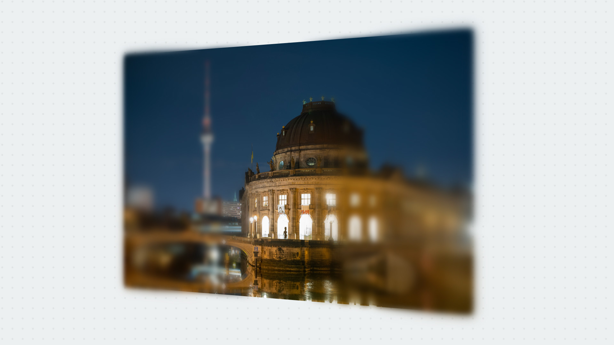
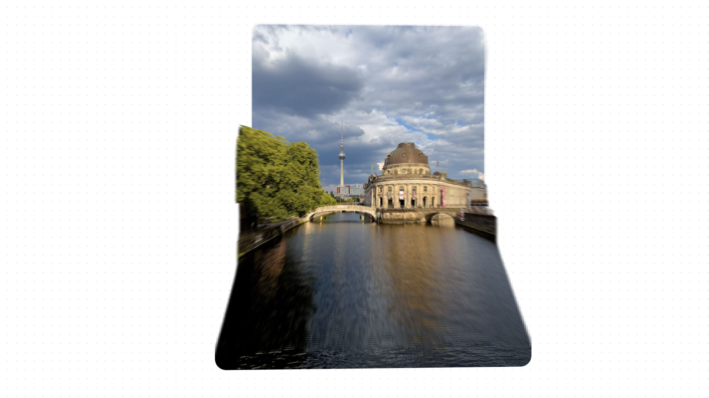

Monorepo of experiments.

### Depth of field

- [Code](https://github.com/javierbyte/depth-of-field/tree/main/apps/depth-of-field)
- Inspired by [Frosted Glass](https://frosted-glass.shud.in/) by [Shuding](https://twitter.com/shuding_).

### Depth mask

- [Code](https://github.com/javierbyte/depth-of-field/tree/main/apps/depth-mask)
- Inpired by [this tweet](https://x.com/raunofreiberg/status/1787887279454683324) by [Rauno](https://x.com/raunofreiberg/) and building upon the Depth of field experiment and my previous experiment on [layers and pointclouds with CSS](https://javier.xyz/blog/css-pointcloud-experiment).
