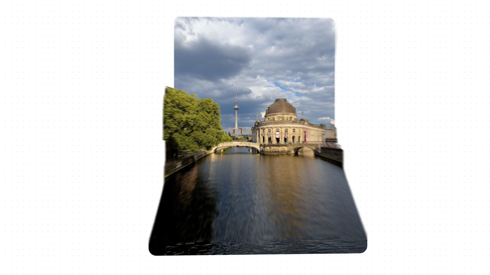

[](https://depth-mask.vercel.app/)

- Inpired by [this tweet](https://x.com/raunofreiberg/status/1787887279454683324) by [Rauno](https://x.com/raunofreiberg/) and building upon the Depth of field experiment and my previous experiment on [layers and pointclouds with CSS](https://javier.xyz/blog/css-pointcloud-experiment).

## Getting Started

This is a [Next.js](https://nextjs.org/) project bootstrapped with [`create-next-app`](https://github.com/vercel/next.js/tree/canary/packages/create-next-app).

```bash
pnpm i
pnpm dev
```

## Regenerating Depth Anything V3 maps

The app serves pre-generated depth maps and never calls Replicate at runtime.
The default V3 generator runs DA3MONO-LARGE at the input image's native
resolution, converts its direct relative-depth prediction to robustly normalized
inverse depth, and saves the result as a quality-90 grayscale JPEG using
MozJPEG. The baked assets match the app's near-is-bright convention without a
runtime curve while remaining compact for web delivery. The combined model
option directly averages corresponding V2 and V3 Mono pixels in the browser
before generating any mask layers.

The Replicate wrapper currently rejects extensionless temporary uploads, so the
generator reads the source JPEGs from the existing static deployment and first
verifies that every downloaded byte matches the local source. To regenerate the
Depth Anything V3 Mono assets, add `REPLICATE_KEY` to this app's ignored
`.env.local`, then run:

```bash
pnpm generate:depth-v3
```

The generator refuses to overwrite existing V3 Mono maps by default. Pass
`--force` to replace them, `--resume` to generate only missing maps after an
interrupted batch, or `--image=isla` to process one named source. The previous
V3 Metric assets and generator remain available through
`pnpm generate:depth-v3-metric`.
